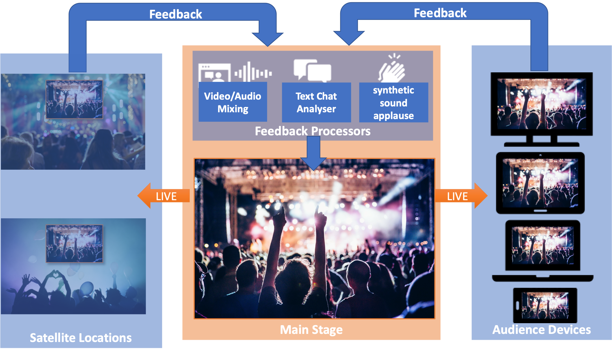
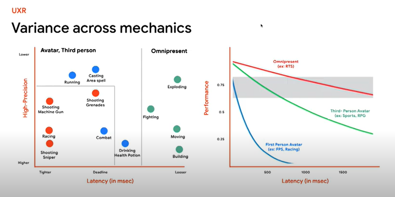
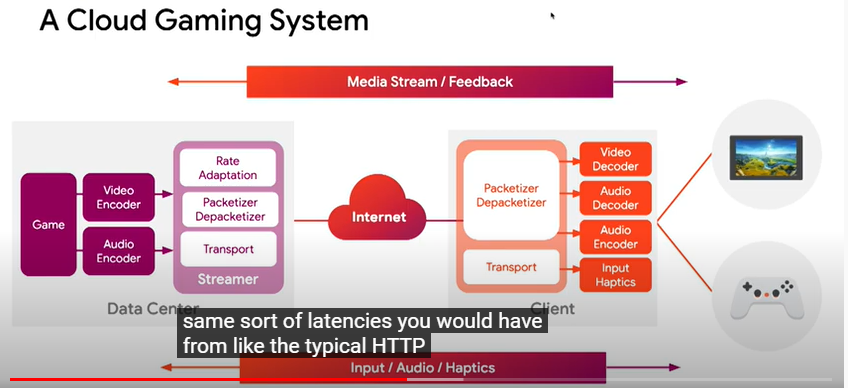
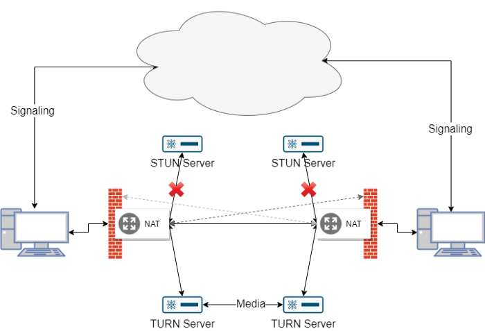
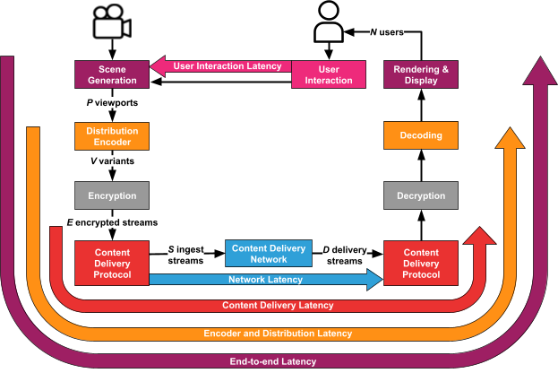
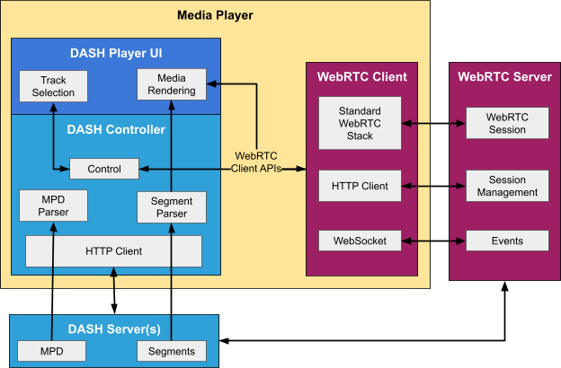
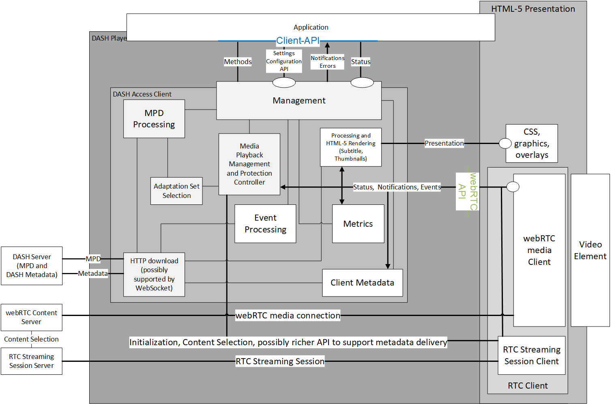
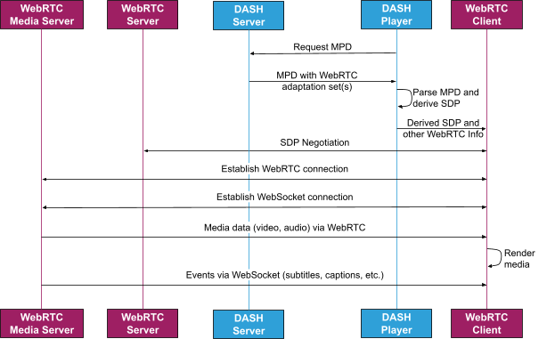
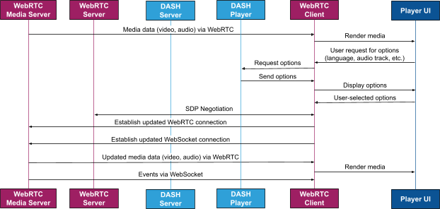
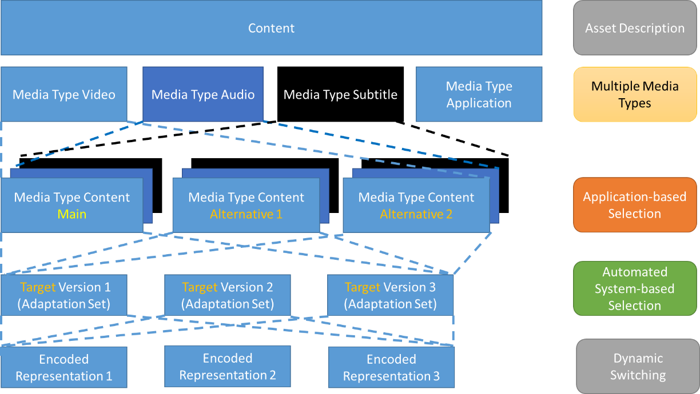

# DASH and WebRTC-Based Streaming


## Scope

This report describes use cases made possible by integrating WebRTC Streaming into the DASH workflows as well as the technical considerations that should be taken into account in order to achieve successful integration. The document is primarily informative and information-collecting. It serves as a preparation and guidance for future technical work in the context of DASH and webRTC-based Streaming. The report was developed by a public efforts in (DASH-IF)[https://dashif.org]. The website of the exploration TF is [https://dashif.org/webRTC/taskforce](https://dashif.org/webRTC/taskforce). 

## Contributors
* Thomas Stockhammer, Qualcomm
* Ali C. Begen, Comcast
* Julia Kenyon, Phenix RTS
* Nathan Burr, Edgecast
* Ofer Shem Tov, Edgecast
* Louay Bassbouss, Fraunhofer FOKUS
* Daniel Silhavy, Fraunhofer FOKUS
* Bill Wishon, Phenix RTS
* Piers O’Hanlon, BBC
* Kashyap Kammachi Sreedhar, Nokia
* Yuriy Reznik, Brightcove

## Table of Contents
 - [Scope](#scope)
  - [Contributors](#contributors)
  - [Table of Contents](#table-of-contents)
  - [1. Introduction](#1-introduction)
  - [2. Use Cases](#2-use-cases)
    - [2.1. Use Case 1: Interactive Live Concerts/Music Events](#21-use-case-1-interactive-live-concertsmusic-events)
    - [2.2. Use Case 2: Sports Betting](#22-use-case-2-sports-betting)
    - [2.3. Use Case 3: Interacting with Broadcast](#23-use-case-3-interacting-with-broadcast)
    - [2.4. Use Case 4: Interacting with Other Audience Members](#24-use-case-4-interacting-with-other-audience-members)
    - [2.5. Use Case 5: Cloud Game Streaming](#25-use-case-5-cloud-game-streaming)
    - [2.6. Use Case 6: Game Spectator Mode](#26-use-case-6-game-spectator-mode)
    - [2.7. Use Case 7: In-Stadium Interactivity](#27-use-case-7-in-stadium-interactivity)
    - [2.8. Use Case 8: Lower Latency Broadcasting](#28-use-case-8-lower-latency-broadcasting)
    - [2.9. Use Case 9: Interleaving Live and Pre-Recorded Content](#29-use-case-9-interleaving-live-and-pre-recorded-content)
  - [3. Baseline Architecture, and KPIs for Live and Interactive Services](#3-baseline-architecture-and-kpis-for-live-and-interactive-services)
    - [3.1. Baseline Architecture](#31-baseline-architecture)
    - [3.2. Key Performance Indicators](#32-key-performance-indicators)
      - [3.2.1. Introduction](#321-introduction)
      - [3.2.2. Latency](#322-latency)
      - [3.2.3. Interaction Delay](#323-interaction-delay)
      - [3.2.4. Formats, Bitrates and Compression Efficiency](#324-formats-bitrates-and-compression-efficiency)
      - [3.2.5. Network Efficiency and Scalability](#325-network-efficiency-and-scalability)
      - [3.2.6. Robustness to Bandwidth Variations and Errors](#326-robustness-to-bandwidth-variations-and-errors)
      - [3.2.7. Multi-User KPIs](#327-multi-user-kpis)
      - [3.2.8. Other Factors](#328-other-factors)
    - [3.3. Expected Impacts for the Use Cases](#33-expected-impacts-for-the-use-cases)
  - [4. Available and Ongoing Work in Industry and Standards for WebRTC Streaming](#4-available-and-ongoing-work-in-industry-and-standards-for-webrtc-streaming)
    - [4.1. Overview](#41-overview)
    - [4.2. Scaling](#42-scaling)
    - [4.3. Session Negotiation](#43-session-negotiation)
    - [4.4. WebRTC Security and DRM](#44-webrtc-security-and-drm)
    - [4.5. Ad Insertion](#45-ad-insertion)
  - [5. Integrating WebRTC with DASH](#5-integrating-webrtc-with-dash)
    - [5.1. Overview](#51-overview)
    - [5.2 Examples of DASH and WebRTC Interoperability](#52-examples-of-dash-and-webrtc-interoperability)
    - [5.3 Example Server Architecture](#53-example-server-architecture)
    - [5.4 Example Client Architecture](#54-example-client-architecture)
    - [5.5 MPD-Based Discovery](#55-mpd-based-discovery)
      - [5.5.1. Simple Server-Based Discovery](#551-simple-server-based-discovery)
      - [5.5.2. MPD-Based Discovery and SDP Derivation](#552-mpd-based-discovery-and-sdp-derivation)
    - [5.6 Session Modification](#56-session-modification)
    - [5.8 Server-to-Client Event Communication](#58-server-to-client-event-communication)
    - [5.9 Usage of DASH MPDs for WebRTC](#59-usage-of-dash-mpds-for-webrtc)
      - [5.9.1 Scope](#591-scope)
      - [5.9.2 WebRTC within the Content Model](#592-webrtc-within-the-content-model)
      - [5.9.3 WebRTC is a Black Box](#593-webrtc-is-a-black-box)
      - [5.9.4 Alternative Content and ABR](#594-alternative-content-and-abr)
      - [5.9.5 WebRTC Content Continuity and Timeline](#595-webrtc-content-continuity-and-timeline)
      - [5.9.6 WebRTC Adaptation Set](#596-webrtc-adaptation-set)
      - [5.9.7 WebRTC Representation](#597-webrtc-representation)
      - [5.9.8 Captions/Subtitles](#598-captionssubtitles)
      - [5.9.9 Events and Timed Metadata](#599-events-and-timed-metadata)
      - [5.9.10 Example MPD](#5910-example-mpd)
  - [6. ​Conclusions and Proposed Way Forward](#6-conclusions-and-proposed-way-forward)
  - [7. References](#7-references)


## 1. Introduction

WebRTC is a set of W3C and IETF standards that allows the delivery of real-time content to users, with an end-to-end latency under half a second. Support for WebRTC is built into all modern browsers across desktop and mobile devices, and it allows for streaming of video, audio, and data. An introduction to WebRTC can for example be found [here](https://medium.com/dvt-engineering/introduction-to-webrtc-cad0c6900b8e). This information is copied here for now to keep the report self-contained. An overview of WebRTC can also be found at [https://webrtc.org/](https://webrtc.org/).

While the original focus of WebRTC was on video conferencing, it is increasingly used today for real-time streaming of premium content because its ultra-low latency enables a number of user experiences, especially those that involve user interactivity, that are not possible with traditional broadcast or streaming delivery protocols. 

Because of this increasing usage for premium content, the integration of WebRTC with other protocols such as DASH can allow for even more robust and innovative user experiences. 

This document outlines example use cases for these user experiences, provides key performance indicators and common terminology as a basis for discussion (see clause 3), such as what is meant by “low latency” in this document (i.e., less than a second). Finally, this document outlines the technical work needed to integrate WebRTC streaming with DASH. 

The goal of this document is to introduce and begin to examine the advantages of and work required to achieve integration of DASH and WebRTC; it is not intended to be a comprehensive report. 


## 2. Use Cases

Real-time media enables a number of real-world use cases. The use cases described below are representative examples, not an exhaustive list. The Wowza colleagues, as an example, have collected a number of use cases around interactive streaming, which can be found at: [https://www.wowza.com/interactive-live-streaming](https://www.wowza.com/interactive-live-streaming)


### 2.1. Use Case 1: Interactive Live Concerts/Music Events

Due to the COVID-19 pandemic, attending public events (such as concerts) has not been possible for some time in a traditional sense. As such, cultural and creative industries are looking for new opportunities in digitizing classic event formats to generate additional revenue streams and attract new target groups. It is expected that after the pandemic, these types of events will be hybrid with physical and online presence. The interaction between the audience and artist/musician/performer on the stage is one of the most important entertainment factors. A key requirement for enabling interactivity is to reduce the end-to-end latency to less than 500 ms. 

This use case includes feedback, either video/audio from satellite locations or “like” or “applause” clicks from the audience. The feedback is processed and displayed/played on the main stage as shown in the figure below. The collected feedback from the audience is used to generate sounds based on the number of participants "applauding" (synthetic applause sound), etc. Synchronization needs depend on which kind of feedback is being provided.



**Figure 2.1-1 Interactive Events.**

### 2.2. Use Case 2: Sports Betting

To enable offsite participants and to offer a premium experience to onsite participants, a provider wants to offer a live stream that will be used for wagering within an event. The content must be delivered with very low latency (less than 500 ms) and more importantly within a well-defined sync across endpoints so customers trust the game is fair (e.g., within 200 ms). There are in some cases legal considerations, for example the content cannot be shown if it is more than a certain number of seconds behind live. Visual and aural quality are secondary in priority in these scenarios to synchronization and latency.

The lower the latency the more opportunities for “in play betting” within the game/event. This in turn increases revenue potential from a game/event. Legitimacy requires having equal conditions among participants, and a key part of equal conditions is that every participant receives the same content at the same time.


### 2.3. Use Case 3: Interacting with Broadcast

A provider wants to offer premium video with interactivity, such as interactive American football where the audience picks the next play, or a multi-angle sports experience where all angles are synchronized. Note that there are two considerations for synchronization: between streams on a single device and streams across devices.

Delivery of content with very low latency is key to the experience, as is synchronized delivery of all streams to all viewers.


### 2.4. Use Case 4: Interacting with Other Audience Members

A provider wants to offer interactive experiences for consumers of media content, including quiz and trivia events and experiences where audience members interact with one another while watching premium content in real time. The content may be either a real-time stream or a pre-existing stream. Interactions could include text chat, video and audio chat, between audience members.

Synchronized playout is key to these experiences to avoid spoiling the experience and maintaining fairness for users that may have lower-bandwidth connections to the internet or are more geographically distant from the content source. There are two aspects to synchronized playout: playout of content and user chat/interactions.

In addition, latency for the inter-audience interactions must be kept to a minimum. The latency of the media content playout can be larger than the latency of inter-audience interactions as long as the playout of the content remains synchronous (within 0.1 seconds) for all users.


### 2.5. Use Case 5: Cloud Game Streaming

Cloud gaming (a.k.a. game streaming) implies that, while the game is being played by a user on an end device, while game processing and rendering is totally or partly performed in a network entity, potentially at the edge of the network. The traffic typically consists of uplink and downlink game status/control information traffic between a client and a server and of downlink streaming of rendered and encoded video and audio.

A typical example is the Stadia platform and an excellent introduction is provided in [this video](https://www.youtube.com/watch?v=avtlQeaxd_I&t=438s). Some extracted high-level requirements on user experience are provided in Figure 2.5-1.



**Figure 2.5-1 Latency impacts in gaming.**

A cloud gaming system is provided in Figure 2.5-2.




**Figure 2.5-2 Cloud gaming system.**

The system design for cloud gaming is provided in  Figure 2.5-3 when for example used in the context of 5G. However, this figure is generic to any access network.



**Figure 2.5-3 Network-based rendering of viewports.**

The following assumptions are taken. The Game Server runs a game engine to generate the game scene based on information coming from a gaming end device, and in multi-user cases also what comes from other users. The gaming server renders the viewport and does a scene pre-rendering.

According to TR 26.928, clause 4.2.2, the relevant processing and delay components are summarized as follows:

* **User interaction delay** is defined as the time duration between the moment at which a user action is initiated and the time such an action is taken into account by the content creation engine. In the context of gaming, this is the time between the moment the user interacts with the game and the moment at which the game engine processes such a player response.
* **Age of content** is defined as the time duration between the moment a content is created and the time it is presented to the user. In the context of gaming, this is the time between the creation of a video frame by the game engine and the time at which the frame is finally presented to the player.

The roundtrip interaction delay is therefore the sum of the age of content and user interaction delay.

For gaming, for example, references [1] and [2] provide interaction delay tolerance thresholds per game type illustrated in the Table below. Note that this Interaction delay refers to the roundtrip interaction delay as defined above.

Interaction delay tolerance in traditional gaming (from [1]):


<table>
  <tr>
   <td><strong>Game Type</strong>
   </td>
   <td><strong>Perspective</strong>
   </td>
   <td><strong>Delay Tolerance</strong>
   </td>
  </tr>
  <tr>
   <td>First person shooter (FPS)
   </td>
   <td>First person
   </td>
   <td>100 ms
   </td>
  </tr>
  <tr>
   <td>Role playing game (RPG)
   </td>
   <td>Third person
   </td>
   <td>500 ms
   </td>
  </tr>
  <tr>
   <td>Real-time strategy (RTS)
   </td>
   <td>Omnipresent
   </td>
   <td>1000 ms
   </td>
  </tr>
</table>


In general, it seems that 60 ms [3], or even 45 ms [4] are better estimates at how much latency is acceptable in the most fast-paced games than the traditionally quoted 100 ms value. For other types of games, the delay tolerance is higher up to one second.


### 2.6. Use Case 6: Game Spectator Mode

Twitch shows that games are watched live with incredible statistics ([https://sullygnome.com/](https://sullygnome.com/)) over the last 365 days.


**Figure 2.6-1 Statistics for Twitch.**

* Fortnite has 1,412,048,240 watching hours over 365 days, this means it is more than 160,000 years

The spectator mode is quite popular. The users can change their in-game position by using controllers and body movement, for example in case of using an HMD. Two types of positions are possible:

* Getting the exact view of one of the participants
* A spectator view independent of the player view

Users may follow on a 2D screen, on VR HMD or an AR Glass. In an extension of the game, the spectators interact with the players and the scene in a sense that the players hear cheering, get rewarded by presence of spectators, similar to a stadium experience.


### 2.7. Use Case 7: In-Stadium Interactivity

A provider wants to offer premium video with interactivity, such as interactive American football where the audience picks the next play, or a multi-angle sports experience where all angles are synchronized. For in-stadium users, the experience is in real time so the user can watch in-person play as well as replays of events (goals, penalties, etc.) via a DVR-like feature. 

Delivery of content with the lowest latency possible is key to the experience. In commercial uses, latency less than one second resulted in positive user feedback. Synchronized delivery of the content to the audience is also critical as the users are potentially sitting next to each other. Real-world users were satisfied when the delivery of content was synchronous to within 0.1 second (see [https://phenixrts.com/en-us/sports-latency.html](https://phenixrts.com/en-us/sports-latency.html), 2021 Super Bowl).

Other key metrics for the replay component of this use case are the amount of time required to switch between the live edge and replay content and from the replay back to live. In the live-to-replay case, segment size is a factor in how long it takes to start a replay, and can be several seconds. The switch back to live should take the same or less time than the initial startup time for the live stream.


### 2.8. Use Case 8: Lower Latency Broadcasting  

A content provider wishes to offer live streams with reduced latency compared to broadcast services enabling more timely engagement with live media, particularly content that is also delivered by broadcast or is likely to have significant social media engagement. 

For this approach, ultra-low latency (less than one second) is not required. However, low cost and ability to deploy at scale are critical. Low-latency DASH and HLS can achieve latencies from encoder to client in the range of 2-4 seconds but to achieve this, the level of resilience to changing network conditions is reduced. If WebRTC could achieve similar latency but with greater resilience or with a better user experience during challenging network conditions, this would be an improvement. 

As such, it may be desirable to source WebRTC streams from existing multi-bitrate encoded media prepared for DASH/HLS streaming and deliver it using existing CDN infrastructure. Whilst the end-to-end latency (EEL) in this use case may not be subsecond, due to such things as contribution and backend latencies which are not always directly controllable, WebRTC can still provide for lower distribution latencies (DL) and better resilience or improved handling of challenging network conditions.


### 2.9. Use Case 9: Interleaving Live and Pre-Recorded Content

A content provider wishes to offer live streams interspersed with pre-recorded content such as advertisements or other announcements. In this case, the live stream requirements remain the same as for other live streams (e.g., less than 500 ms) but the pre-recorded content can have any amount of latency from its recording. The key factors for this use case are the delay in switching back and forth between content sources, which should be minimized (e.g., less than 100 ms) between user display of one source vs. the other. 


## 3. Baseline Architecture, and KPIs for Live and Interactive Services

### 3.1. Baseline Architecture

In order to evaluate the use cases and identify relevant technologies, some architectural assumptions are introduced in the following. Figure 3.1-1 provides a summary of the use case considerations:

* A scene is generated based on interaction from one or multiple or many users as well as based on some stage actions and capturing.
* The scene is encoded, encrypted and prepared for distribution.
* The encoded media is distributed via a delivery network and reconstructed in the device.
* The scene is shown to users that interact again based on the rendered scene.



**Figure 3.1-1 Baseline architecture and KPIs.**

Additionally relevant for deployments are the number of instantiations and copies of processes that need to run on the server and the network. As an example, for DASH-based streaming, several viewpoints may be provided in the DASH MPD among which the user can select for switching. Then, the distribution encoder produces several bitrates (typically five to eight variants) to permit adaptive switching. Encryption is provided for each of the variants and all variants are made available for distribution. The DASH system scales independently of the number of users on the server, only when it comes to distribution from the CDN to the client, the used bandwidth scales with the user. In other types of services, the number of entities may scale with the number of users, for example, if the viewport is rendered for every user.


### 3.2. Key Performance Indicators

#### 3.2.1. Introduction

In order to properly define service requirements, Key Performance Indicators (KPIs) for live and interactive services are collected and defined. Note that not all KPIs are relevant for all services. In general, the following aspects are considered:

* Different latencies, i.e., the time it takes from generation to consumption when running a service across the network.
* Different interaction delays, i.e., the time it takes from an action by the user until the user observes the result of the action.
* Formats and bitrates: What are the expected formats and typically resulting bitrates.
* Scalability: The number of instances that are needed in the network per user and the potential costs for each instance, in other words, how does the architecture scale.
* Robustness: What are the expected robustness requirements that need to be taken into account, for example, packet errors, variation of bitrates.
* Others: E.g., what are the required or at least expected video QoE metrics such as minimum spatial resolution, minimum frame rate, maximum frame drop rates.


#### 3.2.2. Latency

Latencies express times from generation to consumption when running a service across the network. According to Figure 3.1-1, different latencies are defined:

* End-to-End Latency (EEL): The latency for an action that is captured by the camera until its visibility on the remote screen.
* Encoding+Distribution Latency (EDL): The latency of the linear playout output (which typically serves as input to distribution encoder(s)) to the screen.
* Delivery Latency (DL): The latency from encoder output until the media provided to the media decoder. This includes for example latencies added by retransmissions, FEC, or buffering.
* Network Latency (NL): The latency caused by the network delivery from network ingress to network egress.

The most relevant metrics in terms of latency are the EEL as well as the DL. EEL permits to express user experience. DL serves the purpose of evaluating and designing protocols that meet the latency requirements.


#### 3.2.3. Interaction Delay

Interaction delay refers to the time it takes from an action by the user until the user observes the result of the action.

* Time To First Frame (TTFF): The time between a user action (service access or service join) and the time until the first media sample (frame) of the service is perceived by the user when joining at the live edge.
* Seek Startup Delay (SSD): The time between a user action (service access or service join) and the time until the first media sample of the service is perceived by the user when seeking into a time shift buffer.
* Round-trip Interaction Delay (RID): The time of an action by the user until it sees the action reflected on its screen. This delay is the sum of the user interaction delay and the age of the content latency.
* User Interaction Delay (UID): The time duration between the moment at which a user action is initiated and the time such an action is taken into account by the stage performer or content creation engine. In the context of gaming, this is the time between the moment the user interacts with the game and the moment at which the game engine processes the player’s response.


#### 3.2.4. Formats, Bitrates and Compression Efficiency

For each of the use cases, it is beneficial to document answers to any of such questions:

* Are there specific format requirements? 2K, 4K, 8K, multiple views, etc.
* Are there specific requirements for codecs, for example, can only specific codecs be used?
* Are there requirements on specific encoding rules, for example, using backward prediction only for low latency, regular IDR frames, etc.
* Are there specific requirements in bitrate variation, for example, CBR, VBR, capped VBR, CAE, etc.


#### 3.2.5. Network Efficiency and Scalability

For each of the use cases, it is beneficial to document answers to any of such questions:

* What are the requirements on the network to host a single session?
* How is the effort increasing in the network with additional users? Are the efforts linear with the number of users or can there be synergies?
* The efforts need to be checked for each processing stage:
    * Scene generation
    * Media encoding
    * Media delivery
    * Handling client feedback for ABR (e.g. RTCP)


#### 3.2.6. Robustness to Bandwidth Variations and Errors

For each of the use cases, it is beneficial to document answers to any of such questions:


* Bandwidth: How does the available bandwidth and possibly varying bandwidth impact performance?
* Errors: How do packet losses impact performance? How many frames are dropped (PLIs, etc.)?
* Latency: How does network latency impact the performance?
* Timely Adaptation (TA): Does the system adapt to the changing network conditions in a timely manner (e.g., by using a suitable real-time media congestion control algorithm).


#### 3.2.7. Multi-User KPIs 

* Audience Drift Gap (ADG): Time difference between the first user to see a frame of media and the last user to see that same frame of media.
* Impact of user feedback on the scene.
* Scalability of user feedback.


#### 3.2.8. Other Factors

* SCTE-35 messages from contribution links to DASH packagers may be sloppy in the scheduling (still accurate on the content) and not properly used (for example ad avails are signaled without pre-warning, program changes happen w/o announcements, etc.), so decisions in the packager need to be delayed to overcome issues of inaccuracy.
* Also no look-ahead is available for applying segment generation.
* Overall processing delay needs to be added to overcome the sloppiness.
* Audio/video/data synchronization (AVD Sync): The time duration between the rendering of an audio frame, a corresponding video frame, and any corresponding data. If the A/V media or data is delivered out of sync, this may impact the overall EEL.


### 3.3. Expected Impacts for the Use Cases 

<table>
<colgroup>
<col style="width: 3%" />
<col style="width: 26%" />
<col style="width: 70%" />
</colgroup>
<thead>
<tr class="header">
<th></th>
<th><strong>Summary</strong></th>
<th><strong>KPI Impacts</strong></th>
</tr>
</thead>
<tbody>
<tr class="odd">
<td>1</td>
<td>Interactive live concerts/music events</td>
<td><p>EEL less than 500 ms</p>
<p>In terms of network scalability and assuming N users, cloud gaming
runs</p>
<ol type="1">
<li><p>One scene generation process</p></li>
<li><p>One or very few viewports, P = 1 … 5</p></li>
<li><p>One distribution encoder generating multiple variants, i.e., N
times, typically V = 1, …, 10</p></li>
<li><p>One encryption process per Variant, possibly 2 encryption schemes
(cenc, cbcs), i.e. E = 1, … 2. </p></li>
<li><p>Total number of ingest streams S = 1, … 100, independent of the
number of users. </p></li>
<li><p>Total number of delivery streams is D = N, as it is
unicast.</p></li>
</ol></td>
</tr>
<tr class="even">
<td>2</td>
<td>Sports betting</td>
<td><p>EEL less than 500 ms.</p>
<p>ADG less than 200 ms</p>
<p>In terms of network scalability, same consideration as 1.</p></td>
</tr>
<tr class="odd">
<td>3</td>
<td>Interacting with broadcast</td>
<td><p>EEL less than 500 ms</p>
<p>ADG less than 100 ms</p>
<p>In terms of network scalability, same consideration as 1.</p></td>
</tr>
<tr class="even">
<td>4</td>
<td>Interacting with other audience</td>
<td><p>EEL less than 500 ms</p>
<p>ADG less than 100 ms</p>
<p>In terms of network scalability, same consideration as 1.</p></td>
</tr>
<tr class="odd">
<td>5</td>
<td>Cloud game streaming</td>
<td><p>RID is </p>
<ul>
<li><p>less than 100 ms for fast paced games (FPG) </p></li>
<li><p>Several 100 ms up to 1 second for other types of games. </p></li>
</ul>
<p>Uplink latency for actions is typically taking 10-50 ms. Hence, EEL
is typically</p>
<ul>
<li><p>less than 50 ms for FPG</p></li>
<li><p>Less than 200-400 ms for RPG</p></li>
</ul>
<p>In terms of network scalability and assuming N users, cloud gaming
runs</p>
<ol type="1">
<li><p>One scene generation process</p></li>
<li><p>One viewport rendering for each user, i.e., N times</p></li>
<li><p>One distribution encoder for each user, i.e., N times</p></li>
<li><p>One encryption process per user</p></li>
<li><p>One ingest stream per user</p></li>
<li><p>Total number of streams typically N</p></li>
</ol>
<p> </p></td>
</tr>
<tr class="even">
<td>6</td>
<td>Game spectator mode</td>
<td><p>Without interaction and looking at a player view, there is no
latency issue per se, or it is similar to regular sports watching.</p>
<p>If one independently moves in the scene, then the latency gets quite
critical in case the scene is rendered on the network to remain
immersed. 50 ms and lower is needed.</p>
<p>In case interactions are added that impact the scene, similar numbers
as for use case 1 apply.</p></td>
</tr>
<tr class="odd">
<td>7</td>
<td>In-stadium interactivity</td>
<td><p>EEL less than 1000 ms</p>
<p>ADG less than 100 ms</p></td>
</tr>
<tr class="even">
<td>8</td>
<td>Lower-latency broadcasting</td>
<td><p>DL less than DASH</p>
<p>TA better than DASH-ABR</p></td>
</tr>
<tr class="odd">
<td>9</td>
<td>Interleaving live and pre-recorded content</td>
<td><p>EEL less than 500 ms</p>
<p>ADG less than 200 ms</p>
<p>In terms of network scalability, same consideration as 1.</p></td>
</tr>
</tbody>
</table>

## 4. Available and Ongoing Work in Industry and Standards for WebRTC Streaming


### 4.1. Overview

WebRTC was originally created for real-time communication for the Web. This W3C specification and the complementary RTCweb specifications in IETF supports video, audio, and data streaming. It is built into all modern browsers across desktop and mobile devices and is increasingly used today for real-time streaming of premium content.

WebRTC is evolving to include premium content and is integrating with the premium streaming ecosystem via a variety of inputs, codecs, data sources, and consumers.

The WebRTC standard does not define the following:


* How a viewer discovers and joins an experience
* Session negotiation
* Captions/subtitles
* Timed metadata
* Ad insertion
* Digital rights management (DRM)
* Usage of advanced audio & video codecs

Bridging these gaps with standard solutions will maximize interoperability and streamline development and adoption. It also increases the number of use cases for premium content.

Currently, when a viewer discovers and joins an experience, the path to the WebRTC stream is vendor-specific. 


**Figure 4.1-1 Vendor-specific WebRTC discovery.**

In the future, the path should be industry-standard to allow interoperability and flexibility.


**Figure 4.1-2 Standardized WebRTC discovery.**

A good overview on the status and progress on WebRTC for streaming is provided in [5].


### 4.2. Scaling

There is a common misperception that it is not possible to scale WebRTC. Nothing about WebRTC inherently prohibits scaling. Just as CDNs store and forward media data by taking bits off disk and putting them on a network, it is possible to take bits from an input network port and put them on an output network port. Unlike CDNs, however, WebRTC delivery is stateful and requires that the server maintain awareness of the client's state.

Aside from stateful client management, the only additional server-side logic needed to deliver WebRTC streams compared to DASH streams via CDN is Adaptive Bitrate (ABR) to determine which stream is being used as the source for the bits, which usually depends on feedback from each client. Scaled WebRTC delivery generally involves creating content at a set of different bitrates (a bitrate ladder) that is used for multiple viewers rather than creating a special stream tailored for each user. Currently, there is no standardized methodology for delivering WebRTC streams at scale.

Caching as in CDN based adaptive streaming is not supported, but per-user stream replication into the network may be mitigated for example by multicast or application-multicast technologies. 


### 4.3. Session Negotiation

Today, the specific transport method for signaling and session negotiation is left up to each application developer.  In addition, the negotiation requires a number of round trips to establish a connection.

Standard and specific transport methods for signaling and session negotiation are needed to allow interoperability. Various interoperable negotiation methods are in development including the [WebRTC-HTTP Ingestion Protocol (WHIP)](https://datatracker.ietf.org/doc/html/draft-ietf-wish-whip) and the WebRTC HTTP-Based Session Negotiation Protocol (WHSNP)[^1]. WHIP  is specific to ingest/contribution, while WHSNP is designed for both ingest/contribution and for egress/viewing. Both protocols intend to reduce the time to the first frame (TTFF), which is a critical metric in the streaming ecosystem.

WHIP proposes a simple protocol for supporting WebRTC as media ingestion method that:

* Is easy to implement,
* Is as easy to use as current RTMP URIs.
* Is fully compliant with WebRTC and RTCWEB specs.
* Allows for both ingest in traditional media platforms and ingest in WebRTC end-to-end platforms with the lowest possible latency.
* Lowers the requirements on both hardware encoders and broadcasting services to support WebRTC.
* Is usable both in web browsers and in native encoders.

WHSNP is an HTTP-based protocol for establishing WebRTC communications that:

* Allows WebRTC endpoints to publish to media servers or subscribe to content from media servers, using identical communication for both subscribing and publishing. 
* Uses tokens containing capabilities to streamline negotiation.
* Can be used in both web browsers and native applications.
* Allows manual tuning.
* Is simple to implement.
* Is built on commonly-available standards such as HTTP and JSON.

There are three entities involved in WHSNP: a WebRTC Media Server, the WHSNP Client that publishes and/or consumes WebRTC content, and the WHSNP Endpoint that handles negotiation between the two. The WHSNP Endpoint is known to the WHSNP Client, e.g., by querying an associated service's server for a list of available endpoints. This process is outside the scope of WHSNP. 

WHSNP includes fields in its wire format that map to the Session Description Protocol (SDP) definition in the WebRTC standard, and covers all core requirements of WebRTC session negotiation. WHSNP uses an HTTP POST request to provide an SDP offer and ICE candidates, and receives an SDP answer as well as ICE response information to be used when establishing a connection to the Media Server. The response body provides a shared secret, which can be used to authenticate follow-up calls required for the stream. The WHSNP Client uses the ICE candidates received from the WHSNP Endpoint to connect to a Media Server. The same communication is used for both publishing and subscribing, although publishing will include an indication of the publisher capabilities.

WHSNP does not preclude the use of other protocols such as WebSockets for data such as server-to-client data for event signaling or session modification.


### 4.4. WebRTC Security and DRM

Current options for securing WebRTC include Secure Real-time Transport Protocol (SRTP) - Transport-level protocol that provides encryption, message authentication and integrity, and replay attack protection to the RTP data in both unicast and multicast applications. This encryption is node-to-node.

Future options for end-to-end encryption (E2EE) include [Insertable Stream to E2EE](https://webrtc.github.io/samples/src/content/insertable-streams/endtoend-encryption/), which allows customization or manipulation of the data prior to sending it over the wire and [E2EE with secure frame (SFrame)](https://datatracker.ietf.org/doc/draft-omara-sframe/).

For DRM, the goal is end-to-end encryption with secure key exchange. Decryption keys are delayed. This could be interestingly combined with clear key and key rotation.

Current options include WebRTC DataChannel to MSE/EME and WebSockets to MSE/EME (head-of-line blocking). Future options include Insertable Stream to MSE/EME (see [how FaceTime using insertable streams for end-to-end encryption](https://webrtchacks.com/facetime-finally-faces-webrtc-implementation-deep-dive)) and WebTransport to MSE/EME. However, MSE/EME does have some limitations in that it requires CMAF, which isn’t ideal for real-time streaming, since CMAF is a storage container format vs. streaming format, and that the current MSE/EME has some latency issues in different browsers.

Recommended options are:

* WebCodecs + EME (without CMAF packaging). Bridge gaps between WebCodecs and EME
* DataChannel or WebTransport or Insertable Streams to WebCodecs and EME (without CMAF packaging)
* Client-side demuxing
* AES-128 CBCS encryption of only the elementary stream 
* Following a single encode and encryption path and multi-package approach compatible with DASH


### 4.5. Ad Insertion

Client-side ad insertion can be accomplished in WebRTC by announcing the ad break via a SCTE event via the data channel, WebSockets, or other means as noted in clause 5.7. Clients use the ad break information to switch between live content and ad content.

However, this typically would require two instances of a video element and blending. Usage of a single video element, and then a single video decoder requires additional integration work between the streaming client and the playback platform. Please see the discussion in clause 5.9.5.

Server-side ad insertion (SSAI) requires integration between the WebRTC server and the ad server to provide smooth transitions between ad content and live content.


## 5. Integrating WebRTC with DASH


### 5.1. Overview

A brief comparison between DASH and WebRTC is summarized in the following Table.


<table>
  <tr>
   <td><strong>Feature</strong>
   </td>
   <td><strong>DASH</strong>
   </td>
   <td><strong>WebRTC</strong>
   </td>
  </tr>
  <tr>
   <td>Content Description
   </td>
   <td>MPD: Same for all users, describes all available content. Note that part of the MPDs may describe personalized content such as ads.
   </td>
   <td>SDP: Unique for each client, typically with a single audio and a single video.
   </td>
  </tr>
  <tr>
   <td>Media Selection
   </td>
   <td>Client selects media, bitrate, and codecs.
   </td>
   <td>Server selects or adapts bitrate, codecs negotiated between the server and client.
   </td>
  </tr>
  <tr>
   <td>Subtitles/Captions
   </td>
   <td>Standardized.
   </td>
   <td>Proprietary if available at all.
   </td>
  </tr>
  <tr>
   <td>Timing
   </td>
   <td>Buffered and time synched.
   </td>
   <td>Immediately rendered.
   </td>
  </tr>
</table>


### 5.2 Examples of DASH and WebRTC Interoperability 

Some examples of integration and interoperability points between DASH and WebRTC include:

* A real-time live event using WebRTC streams defined in a DASH MPD.
* A complex real-time live event with multiple synchronized streams, for example, using WebRTC representations with multiple adaptation sets for different camera angles.
* A real-time live event with both WebRTC and DASH adaptation sets. The player will prefer the WebRTC adaptation set and will fall back to the DASH adaptation set. Reasons for falling back can include a device that doesn't support WebRTC, a firewall that blocks WebRTC, or a network connection that is not good enough to sustain a very low latency stream.
* A manifest for a linear channel can contain periods for regular programs and periods for interactive programs. The periods for interactive programs will use  WebRTC for real-time streaming, while regular periods will use DASH for lower cost and higher reliability. 
* Co-watching synchronized streams with audio/video/text chat. The content can use live streams over WebRTC or DASH, and VOD over DASH . The manifest will include information about connecting to the WebRTC-based interactive endpoints for the audio/video/text chat. Content synchronization signaling can be carried between watchers via WebRTC data channel (see new Apple SharePlay as an example). This use case requires more standardization efforts in addition to the basic WebRTC streaming.
* A real-time live event with both WebRTC and DASH adaptation sets. The player starts with WebRTC and offers a DVR seek bar. Once the user seeks back in the event timeline, the player switches to using DASH adaptation sets for streaming past content. Once the user selects to go back to live then the player switches back to the WebRTC adaptation set.
* A real-time live event using WebRTC while the ad periods are delivered with DASH. The WebRTC data channel or another type of data channel (as discussed in clause 5.8) is used to signal MPD refresh for loading the next ad periods. The WebRTC periods include signaling to the player to keep the WebRTC session (in low bitrate mode) so switching back to live content will be fast.


### 5.3 Example Server Architecture

An example of an architecture for WebRTC-based content ingest and delivery is shown below. The WebRTC connections are indicated with solid lines, the dotted lines could be any protocol. Although it is not required that the content processing and delivery steps are performed by cloud services, they typically are in order to support scaling delivery to large audiences or processing content from a multitude of publishers. Note that the pre-recorded content and the WebRTC-originated content are both provided to the same DASH Manifest creation entity. This allows the manifest to contain information about the WebRTC stream as well as the DASH stream.


**Figure 5.3-1 Example WebRTC and DASH server architecture.**


### 5.4 Example Client Architecture

On the client side, a Media Player can include both a DASH and WebRTC client. When the DASH client receives an MPD, it parses it and selects tracks based on the user's preferred language and other factors. If WebRTC is available in the MPD, the DASH client sends a request to the WebRTC client indicating the media IDs and initialization parameters for the selected streams. 

The WebRTC Client performs SDP negotiation and receives the media streams. These streams can be rendered by the WebRTC client or passed to the DASH client for further processing and rendering via APIs. Other APIs are used to provide control and communication between the DASH Client and the WebRTC Client. In addition, translation of metrics available to the WebRTC client are translated into DASH metrics, where available, and communicated via API. 



**Figure 5.4-1 Example WebRTC and DASH client architecture.**

Figure 5.4-2 provides an alternative view on the DASH WebRTC network and client architecture, based on the DASH-IF IOP v5 client architecture. In this case, the events and DASH metadata are handled by the DASH access client. The Adaptation Set selection is done in the DASH client, but the RTC session client is informed about any changes. The figure also includes metrics and client metadata.





**Figure 5.4-2 Alternative view of the DASH WebRTC network and client architecture.**

Figure 5.4-3 provides a hybrid DASH WebRTC network and client architecture. In this case, the media is also offered as DASH Segmented media, for example to address time-shift viewing, etc. Note that in this case, also MSE APIs are used for playback. This would require a second video element and blending between WebRTC and MSE. Another option is documented in Figure 5.4-4 for which a single video element is used through MSE, and the WebRTC delivered content would be repackaged to be played back through such an architecture.


**Figure 5.4-3 Hybrid MSE and WebRTC network and client architecture with two video elements.**


**Figure 5.4-4 Hybrid MSE and WebRTC network and client architecture with single video element and MSE playback only.**

Note that the architectures at this point are more thought experiments than they are finally agreed. Different options need further evaluation for practical implementation constraints.


### 5.5 MPD-Based Discovery

There are two proposed mechanisms for the discovery of WebRTC streams via an MPD, one which assumes that the DASH and WebRTC servers communicate but are not tightly integrated, and another which provides optimizations that are only available if the two are tightly integrated.

#### 5.5.1. Simple Server-Based Discovery

The first proposed mechanism is shown in Figure 5.5-1. The default streams are selected by the DASH player in order to preserve a low TTFF, and information for obtaining these streams is passed to the WebRTC Client. DASH event messages are sent over the WebSocket connection, possibly using inband event message streams. 



**Figure 5.5-1 DASH discovery of WebRTC streams.**

Note that the IP address of the Media Server is available in the SDP. 


#### 5.5.2. MPD-Based Discovery and SDP Derivation

In an alternative to the traditional MPD-Based discovery model shown above, a DASH MPD may contain additional elements and attributes either at the Adaptation Set level or at the Representation level or both which help the DASH client to derive an SDP. A DASH client makes a mapping of the existing and additionally signaled elements and attributes in the DASH MPD to the parameters of an SDP and derives an SDP out of this process. The derived SDP is then passed to a WebRTC client. Figure 5.2-2 shows a WebRTC streaming session with MPD-Based discovery and SDP derivation.


**Figure 5.5-2 DASH discovery of WebRTC streams and SDP derivation.**

The SDP derivation process is a mapping of the DASH-MPD attributes to the SDP parameters. The described approach deviates from the traditional SDP offer answer model where a WebRTC client expects an SDP offer only after establishing a connection with the WebRTC server. The derivation of SDP from the DASH MPD, however, will help the WebRTC client to provide its preference already as an SDP answer. This approach can reduce session negotiations times which could be critical for conversational and premium streaming use cases. However, this requires a tighter integration of the MPD and the SDP server than the approach in clause 5.5.1.


### 5.6 Session Modification

When alternate content is available (e.g., alternate language tracks), the DASH client can present those options to the user following the initial connection to the streams, as shown in Figure 5.6-1. If a user wishes to change the media stream (e.g., switch to a different audio language), there are two methods of changing the stream content. 

In one method, the WebRTC client API can inform the DASH client of the current alternate content and also use callbacks to inform of alternate content changes. The same method can be also used by the DASH client to ask to switch between different representations, for example, different video bitrates.

In the second, more standards-based method, the DASH client provides the WebRTC client with updated information, at which point the WebRTC client will use the session negotiation protocol to ask the  WebRTC Media Server to send the different language using the already active stream or in the case of subtitles language, send the new language messages over the already active WebSocket event connection.


**Figure 5.6-1 Alternate WebRTC streams with SDP renegotiation.**


### 5.8 Server-to-Client Event Communication

The RTC data channel typically used in WebRTC to send event information is designed and suitable for peer-to-peer (or client-to-client) communication. However, for large-scale communication of event information such as servers providing closed captioning information to numerous clients, alternative methods such as WebSockets are more suitable and hence typically used. One or more of these methods may be standardized in the future.


### 5.9 Usage of DASH MPDs for WebRTC


#### 5.9.1 Scope

To describe WebRTC stream contents, a manifest is needed that can describe main content, alternative content such as camera angles, audio languages, captions/subtitles, etc. It is  proposed to use the DASH MPD as the basis for the WebRTC manifest as it is widely adopted as an industry standard, solves many perceived needs, and allows code reuse. It is also proposed that the manifest will describe the same content for both DASH streaming and WebRTC streaming since there are many use cases that can be implemented with both streaming technologies. This would benefit DASH as it adds new use cases: a DASH extension for real time interactive streaming.

In order to support the content author in providing content in a consistent manner, Figure 5.9-1 provides a conceptual content model for DASH content in one Period of an MPD as shown in DASH-IF IOP Guidelines. The content may be described by an Asset Identifier as a whole and may contain different media types, video, audio, subtitle and application types.



**Figure 5.9-1 DASH content model.**

Within each media type, the content author may want to offer different alternative content that are time-aligned, but each alternative represents different content. Automatic selection of the alternative content is not expected to be done by the DASH client as the client would not have sufficient information to make such decisions. However, the selection is expected to be done by communication with an application or the user, typically using a user interface appropriate for selection. 

In the absence of an app supporting such decisions, or at startup, the DASH client needs to playback content and therefore benefits from information of what is the default content. Such signalling should be provided by the content author. Such default content is referred to as main content, whereas any content that is not main is referred to as alternative. There may be multiple alternatives which may need to be distinguished. The DASH MPD provides means to define main and alternative content using the Role descriptor. Alternative content may for example be further described by Viewports or Labels. Examples for such are synchronized camera views of one master content. The main camera view is provided as main content, all other views as alternative content.

Furthermore, it may be that content of different media types is linked by the content author, to express that two content of different media types are preferably played together. The DASH MPD provides means to define linked content using the Viewport descriptor. As an example, there may be a main commentator associated with the main camera view, but for a different camera view, a different associated commentary is provided.

In addition to semantic content level differentiation, each alternative content may be prepared with different target versions, based on content preparation properties (downmix, subsampling, translation, suitable for trick mode, etc.), client preferences (decoding or rendering preferences, e.g., codec), client capabilities (DASH profile support, decoding capabilities, rendering capabilities) or user preferences (accessibility, language, etc.). Target versions address the ability by the client to select content based on the client’s capabilities, for example by dynamically querying the platform capabilities. Different MPD elements and attributes support the selection, for example, the `@codecs` attribute, `@profiles` attribute, a Language element, an Accessibility descriptor, maximum spatial and temporal resolution, or specific Role schemes. In simple AV playout and in the absence of guidance from an application, a content author expects that the DASH client selects at most one target version for each Group taking into account its capabilities and preferences and the capabilities and preferences of the media subsystem. An application may select multiple Groups and playout different video Adaptation Sets to support for example picture-in-picture, multi-angle and so on. 

In addition, the content author may also provide priorities for target versions, if the receivers support multiple of those. The content author may also define priorities in the selection, for example if the client supports multiple capabilities, using the @selectionPriority attribute. Typical examples are that the content is prepared for H.264/AVC and H.265/HEVC capable receivers, and the content author prefers the selection of the H.265/HEVC version as its distribution is more efficient. A device supporting both decoders may then choose the one with higher priority signalled by the content author. In a similar version, the same content may be provided in different languages. In this case, it can still be expected that the language can be automatically selected by the client, so it is assigned to a target version. Again, a content author may express priorities on languages, for example preferring the native language over a dubbed one. Languages may be considered as alternative content as well, but as long as automatic selection can be provided, it may be considered as different target versions. Hence, for each content of one media type, different target versions may exist and the annotation of the content expresses that it is expected that automated selection can be done. The tracks and Representations of each target version are preferably assigned in one Adaptation Set in order for the client to select an Adaptation Set for playback. In advanced service offerings, Preselections and/or dependencyIds may be used to select multiple Adaptation Sets. 

As a means for optimizing the WebRTC session, the content author may additionally provide DASH elements and attributes either at Adaptation Set level or at Representation level within the DASH MPD which help the DASH client to generate Session Description Protocol (SDP) information. This SDP information may be used in the context of the operation described in clause 5.6.

Finally, in the content model, each of the target versions typically has multiple Representations that are prepared to enable dynamic switching. 

This clause identifies to what extent the above model may be useful for a WebRTC based streaming approach.


#### 5.9.2 WebRTC within the Content Model

Since the manifest might describe some content as accessible via both DASH and WebRTC, the client needs to understand when and how to select the WebRTC or the DASH content. Since this is rarely an explicit user choice, the WebRTC content should be described as an additional target version, i.e., in a separate Adaptation Set.  It is essential that only clients supporting WebRTC-based streaming would pick up the WebRTC Adaptation Set.

The `@selectionPriority` attribute can be used by the content author to signal that this is the prefered target version to use. The @profiles attribute with a WebRTC schema URI can be used by clients that support this profile to consider those target versions, while clients that do not support this profile will ignore those target versions. If preferring WebRTC target versions when available is the common choice, then maybe this should be the default for the WebRTC profile.


#### 5.9.3 WebRTC is a Black Box

Since WebRTC content is described within the SDP, which is not available to the application, the manifest is used only for signaling to the application what is available within the WebRTC content. This can be used for selection and for user interface. It is similar to signaling video content that carries CEA-608 captions. WebRTC content defines video and audio, both of which can have multiple codec options. Video can also have embedded captions/subtitles.

If the SDP includes information that is relevant for the DASH player, this information may be duplicated on the MPD level, similar as is done for the Initialization Segment and the MPD. We recommend that there be no mismatch between the attributes and semantics in the SDP and the MPD, and there should also be a statement on precedence if one or the other is used.

In addition, there is WebRTC session information, which is not part of the SDP or the WebRTC standard. This information is used to describe alternative content and it is required by the DASH player in order to ask the WebRTC server to switch to alternative content. This information is returned by the session negotiation protocol and is also populated in the MPD.


#### 5.9.4 Alternative Content and ABR

Because WebRTC is a black box, switching between alternative content options is different from how it is done in DASH. The player will know about the alternative content since it will be populated as MPD Adaptation Sets and will ask the WebRTC Server, using the session negotiation protocol, to switch between alternative content. The WebRTC server will start sending the alternative content on the already open connections, allowing for seamless and fast transition. When starting the WebRTC session, the player can send the server, as part of the session negotiation protocol, the initial alternative content to start with. The player can use the standard DASH way of choosing alternative content in order to decide what alternative content to start with. One challenge is for the player to figure out what is supported by the WebRTC client. For example, although all available codecs might be populated in the MPD,  the actual codecs to use are negotiated between the WebRTC client and the WebRTC server using SDP offer and answer. The player does not have visibility to that negotiation unless the WebRTC client exposes some API, similar to MediaSource.isTypeSupport() in addition to an API that exposes what was actually selected. If such an API is not available on some platforms the player can just let the WebRTC client decide and disable the relevant user interface if it cannot determine what is possible.

ABR implementation for WebRTC sessions is similar to how alternative content is handled. In WebRTC, the WebRTC server and client negotiate the codec to be used as discussed above, and the server decides which bitrates to use depending on factors such as the client's connection throughput. Each WebRTC session will use up to one audio and one video track. The WebRTC server will implement the ABR logic, based partly on feedback from the WebRTC client, and will send the different audio/video content on the already opened tracks. This will allow for seamless ABR switching. The different bitrates and resolutions available can be received as part of the session negotiation and will be populated in the relevant Adaption Sets Representations. The DASH player can use this information to ask the server, using the session negotiation protocol,  to send different bitrates or to switch to automatic ABR mode. The WebRTC client will send the player window resolution to the WebRTC server when the session is initialized so the server has an input to the WebRTC server ABR logic. The player can use the same session negotiation protocol to update the WebRTC server when the player resolution changes.


#### 5.9.5 WebRTC Content Continuity and Timeline

Unlike DASH streaming where the client downloads CMAF content, can stitch content and can calculate its position, WebRTC clients have less control over what content they receive.  This create two challenges:

* What timeline to use, especially to correlate with timed metadata and how to make this timeline available to the player.
* When switching periods, or even after re-buffering, it might not be possible to stitch content smoothly/accurately and it might be more of a best effort. This might not be a huge problem because it is always live content with very low latency so the user experience can still be acceptable.

From a specification perspective, it is important that there be a mapping of the content in one WebRTC stream to the common MPD timeline. Once this is achieved, MPD functionalities such as Periods or Events or synchronization can directly be combined with WebRTC-based streaming.

Until this is possible, with new extensions to WebRTC that are being proposed, it is possible to use the real time nature of WebRTC streaming to achieve  reasonable results. If it is assumed that audio and video received from the WebRTC session is from current time, the margin of error will be the WebRTC session latency that can be around half a second, as this is typical latency for WebRTC communications [6], [7].

Another challenge is switching from WebRTC periods to DASH periods. In WebRTC audio and video data are pushed from the server and the client has no control except starting and stopping the stream. An example implementation of switching can be:

* **DASH to WebRTC:** Once DASH segments are done downloading but the period is still playing, or two seconds before switching time, WebRTC session is started on a separate video element. Once DASH playback is over, switch to WebRTC video element, what is live will be visible to the user. No bandwidth overlap
* **WebRTC to DASH :** DASH segments are starting to download a few seconds before switching time. Video elements are switched on time and then the WebRTC session is stopped. Bandwidth overlap exists. WebRTC is usually more aggressive (will usually use UDP) so hopefully the WebRTC session will not be affected by the bandwidth consumed by the DASH downloads.

Since using multiple video elements can be a problem (auto play restrictions, etc.) a future implementation might be able to render the WebRTC session on the same video element using Media Source Extensions (MSE). This will be possible using the new WebRTC insertable streams API that provides JavaScript access to the audio/video frame data. The JavaScript player can repackage the WebRTC audio/video as mp4 segments and use the same video element that is used for rendering DASH segments that were downloaded over HTTP.


#### 5.9.6 WebRTC Adaptation Set

In order to integrate WebRTC properly into a DASH MPD, different Adaptation Set parameters need to be provided. It seems to be beneficial to assume that in the MPD different  media streams that are available at the server are separately announced and accessible to benefit from the late binding functionality. Using the logic from the CMAF profile for DASH content, the following needs to be defined for a WebRTC Adaptation Set:

* Initialization information for the Adaptation set, for example through the `@initializationPrincipal `attribute (defined in the 5th edition of DASH) or by using the Init Segment. This may for example be a reference URL to the WebRTC session negotiation endpoint, WebRTC content ID and required auth information (params might be embedded in the URL or seperate).
* The `@mimeType` is set according to the SDP parameter of the a= line to which this refers, e.g., `video RTP/AVP`.
* The `@codecs` parameter is set to identify the codecs profile and level that matches the a= line, e.g., `H264/90000 `or the information is translated into RFC6381 language.
* Additional media specific parameters such as height, width, framerate, language, etc. are expected to be set.
* For content protection, a new descriptor needs to be defined.
* The `@presentationTimeOffset` may be set to anchor the time of the WebRTC session to the DASH Media Presentation timeline in order to possibly time-accurately synchronize DASH streams and WebRTC streams. Necessity and feasibility of this in operation needs further checking. For details, also refer to clause 5.8.9.
* Captions/subtitles carried over video or the WebRTC data channel or via another means (as discussed in clause 5.7) can be signaled with the Accessibility node.


#### 5.9.7 WebRTC Representation

For every adaptation set, the representations can provide information about media type, including multiple media representations when available. 

For example, for video adaptation sets:

* Representation for each available bitrate and resolution available for the WebRTC session. The WebRTC server will use a technique called simulcast to change bitrate on the existing single video track. The player can use the information in the representations to present a user interface with specific bitrate or resolution options so the user can select a specific representation or switch back to auto ABR mode. The WebRTC client can then ask the WebRTC server, using the session negotiation protocol, to switch bitrates. The WebRTC client should expose to the player what is the current bitrate and if in auto ABR  mode.  
* Scalable video codecs are starting to be supported in WebRTC communication. While scalable video coding may look as a good fit with DASH streaming, until today no deployments are known. More study would be needed.


#### 5.9.8 Captions/Subtitles

The WebRTC server will send captions/subtitles over a data channel as discussed in clause 5.7. Although the captions/subtitles can carry presentation time information relative to the WebRTC session timeline, until WebRTC timeline is standardized the captions/subtitles can use the receiving time as the presentation time. Because of the very low latency this fallback might be good enough. DASH subtitles/captions formats such as IMSC1 can be carried over a data channel so player rendering code can be reused. An alternative would be to carry CEA-608 subtitles in the video. Extraction of CEA-608 captions is not natively supported in the downstream pipeline, but the caption data could be signaled with the manifest and extracted by the WebRTC client. The player may be able to parse the subtitle data using the new WebRTC insertable streams API which is available currently in Chrome. Note that while CEA-708 data can be present in the SEI, it is almost always coded from CEA-608 captions, and it is thus better to focus on CEA-608 captions. 


#### 5.9.9 Events and Timed Metadata

Delivery of ad insertion markers, captions, and other timed data is not specified by WebRTC. Implementers use WebRTC reliable bi-directional data channel to send this data via proprietary messages. To standardize this data, DASH in-band events and MPD events, such as SCTE-35 events, could be sent over the WebRTC data channel, while custom events could continue to use a standard format including schemeIdUri, etc. to avoid collision between different vendors.

* In-band events (emsg box) will be sent via WebRTC data channel carrying identical data.
* Support for the standard in-band event to signal the player to perform MPD refresh.
* MPD events can be delivered via the MPD which will be refreshed just in time using MPD refresh signal.

Another option would be to send events on an alternative data channel as described in clause 5.7.

In-band event timing is similar to the timing discussed in 5.5.8 (Captions/Subtitles). MPD events are relevant only when the WebRTC timeline will be standardized.


#### 5.9.10 Example MPD

The example below is an initial example of an MPD, but more work will be required to better define WebRTC streams in MPDs.

```
<?xml version="1.0"?>
<MPD
	xmlns:xsi="http://www.w3.org/2001/XMLSchema-instance"
	xmlns="urn:mpeg:dash:schema:mpd:2011"
	xsi:schemaLocation="urn:mpeg:dash:schema:mpd:2011 DASH-MPD.xsd"
	type="static"
	mediaPresentationDuration="PT24S"
	availabilityStartTime="2014-10-17T17:17:05Z"
	minBufferTime="PT4S"
	profiles="http://dashif.org/profiles/WebRTC/2021">
    	
	<Period id="1">
    	<!-- Video -->
    	<AdaptationSet
        	contentType="video"
        	id="1"
        	mimeType="video RTP/AVP"
        	codecs="avc1.4D401F"
        	maxWidth="1080"
        	maxHeight="720"
        	maxFrameRate="30"
        	<SegmentBase timescale="90000" media="entry.sdp#m=49170"/>
        	<Representation id="video" bandwidth="250000"/>
    	</AdaptationSet>
    	<!-- Audio -->
    	<AdaptationSet
        	contentType="audio"
        	id="2"
        	mimeType="video RTP/AVP"
        	codecs="mp4a.40.5"
        	<SegmentBase timescale="90000" media="entry.sdp#m=51372"/>
        	<Representation id="audio" bandwidth="250"/>
   	</AdaptationSet>
	</Period>
</MPD>
```

## 6. Conclusions and Proposed Way Forward

Based on this report, the advantages of integrating DASH services with WebRTC are clear. This report has provided different use cases and summarized service requirements. A number of these use cases, especially those discussed in clause 5.2, such as insertion of pre-recorded DASH-based ads into live streams delivered via WebRTC, require the combination of DASH and WebRTC.

Some argue WebRTC is the best or only option for delivering live content, and insist that DASH is the only solution for other cases, but there are a number of synergies when combining DASH and WebRTC. The two have a number of complementary aspects for content acquisition and rendering which can be used to create hybrid operations instead of being separated into distinct entities. This is discussed at length in clause 5 of this document. One example of unified technologies is the hybrid client, which combines the DASH player and the WebRTC stack to provide the integrated user experience required for use cases that require WebRTC-supported  interactivity alongside DASH content.

This report also summarizes existing technologies that are not yet in DASH and WebRTC. Generally, the following future work is recommended:

* Define a hybrid architecture that supports both DASH and WebRTC.
* Combine existing DASH and WebRTC technologies.
* Work on extensions to DASH and WebRTC as described below.

For extensions to WebRTC, the following is recommended:

* Define and select appropriate session management/signaling protocol (potentially based on WHIP/WHAP or WHSNP)  [clause 4.3]
    * Define control protocol for dynamic stream switching that does not require SDP renegotiation  [clause 5.6]
* Continue development of methods for additional security of streams [clause 4.4]
* Define a standardized means to deliver subtitles, closed captions, and other events  [clause 5.9.8]
* Continue development of a mechanism for time synchronization of timed metadata and DASH periods [clause 5.9.9]
* Collection of metrics and client metadata for WebRTC sessions and translation to existing metrics and client metadata, transmission via APIs. [clause 5.4]

For DASH the following is recommended:

* Determine APIs to be used between WebRTC clients and DASH clients [clause 5.4]
* Define how WebRTC information is represented in MPDs [clause 5.9.7]
* Determine whether DASH and WebRTC can both render to a single browser's video element or switch between two video elements [clause 5.9.5]
* Support hybrid operations with WebRTC and DASH HTTP-based operations

In order to address the different topics, different organizations may have to be involved. However, it is expected that based on the analysis and proprietary deployments, quite many technology enablers are in place and a basic system can be deployed. It is considered beneficial to create deployment guidelines to support interoperability for WebRTC-based streaming based on existing practices. Such guidelines may also be supported by reference tools and/or test services.

While DASH-IF is not necessarily the only organization that may take on a coordination role, it may be well suited based on its mission to support deployments, while not creating new specifications and standards (unless identified that no other organization is able to do so). DASH-IF also has a proven history, track record and foundation to support deployments by reference tools, for example DASH-IF test vectors and services, dash.js reference tools and the conformance software. DASH-IF also has regular information exchange with different organizations such as ISO/IEC JTC1 SC29 (MPEG), CTA WAVE, DVB, ATSC, IETF, W3C, HbbTV and 3GPP.

Based on this DASH-IF invites to take on the coordination role for defining a WebRTC based streaming system based on the knowledge from DASH deployments. The focus of the initial effort would be as follows:

* Document deployment and interoperability guidelines for DASH-based WebRTC streaming along the findings in this report, based on existing technologies.
* Identify gaps and optimization potentials for such a system and coordinate with other organizations such as IETF, MPEG, or W3C to address the development of new technologies to address these issues.
* Collect additional use cases and requirements from the industry and other organizations.
* Identify necessities and opportunities to develop reference and test tools to support the above deployments.

This report and the invitation is preferably shared with organizations such as ISO/IEC JTC1 SC29 (MPEG), CTA WAVE, DVB, ATSC, IETF, W3C, HbbTV and 3GPP, also to individual members. In addition, this information should also be shared outside standardization communities, for example on social media, in presentations and blogs. Along with this report and the invitation, feedback from the organizations and individuals should be collected on the above proposed process.

The following timeline is considered:

* Disseminate and share the information from March 1, 2022 onwards and ask for feedback until April 15, 2022.
* Unless the feedback is negative or there are specific concerns, DASH-IF will start a dedicated, members-only activity on this matter by May 1, 2022. 
* The primary objective of the initial activity is to deliver interoperability guidelines for DASH-based WebRTC streaming, to be published for community review by the end of 2022 under the DASH-IF publication policy.

Questions to members and organizations should be set up by a survey and should include:

* Question on interest on such a project in general
* The timeliness of the activity
* Participation interest to develop deployment guidelines, and if interested, in which parts of the guidelines (negotiation, DASH/WebRTC player, etc.)
* Whether the development activity should be members only or open to all interested parties
* If there are concerns if DASH-IF takes on the duty and if interested parties not yet DASH-IF members would consider joining DASH-IF
* What output would you expect from the work: guidelines, reference services, reference clients and/or servers; and which of these would you be willing to contribute


## 7. References

[1] "Cloud Gaming: Architecture and Performance", Ryan Shea and Jiangchuan Liu, Simon Fraser University; Edith C.-H. Ngai, Uppsala University; Yong Cui, Tsinghua University; IEEE Network-July/August 2013.

[2] M. Claypool and K. Claypool. Latency and player actions in online games. Communications of the ACM, 49(11):40–45, 2006.

[3] Quax, P., Monsieurs, P., Lamotte, W., De Vleeschauwer, D., and Degrande, N. Objective and subjective evaluation of the influence of small amounts of delay and jitter on a recent first person shooter game. In Proceedings of 3rd ACM SIGCOMM workshop on Network and system support for games (New York, NY, USA, 2004), NetGames ’04, ACM, pp. 152–156.

[4] Chen, K.-t., Huang, P., Wang, G.-s., Huang, C.-y., and Lei, C.-l. On the Sensitivity of Online Game Playing Time to Network QoS. Proceedings of IEEE INFOCOM 2006. 

[5] Alexandre Gouaillard, “VES204. Deploying WebRTC In A Low-Latency Streaming Service”, Founder and CEO, CosMo Software Consulting and IETF, W3C, AOMEDIA, [https://www.youtube.com/watch?v=AFEn3HXBczA](https://www.youtube.com/watch?v=AFEn3HXBczA)

[6] "Latency contributors in WebRTC-based remote control system", Sakari Tanskanen, Master's Thesis for Aalto University School of Science, 22 January 2021.

[7] "Review: Real-Time Streaming at Scale for Wowza Streaming Cloud", Tim Siglin, October 14, 2021. [https://www.wowza.com/blog/review-real-time-streaming-at-scale](https://www.wowza.com/blog/review-real-time-streaming-at-scale) 
